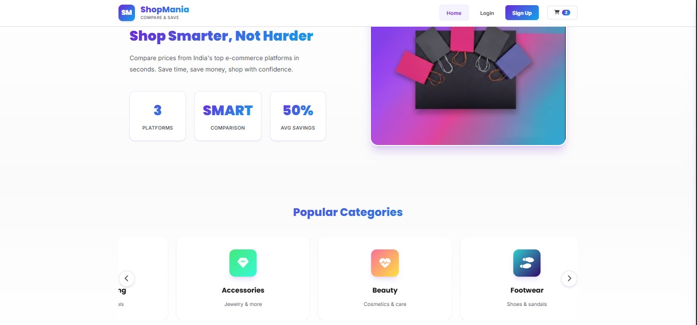
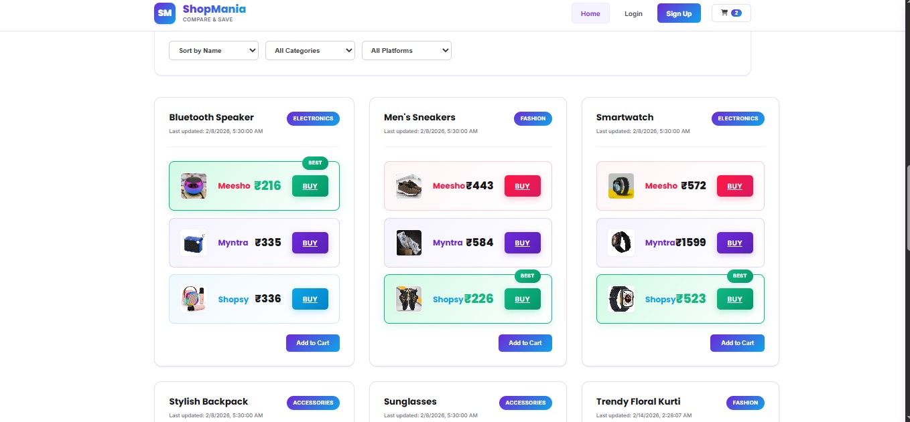
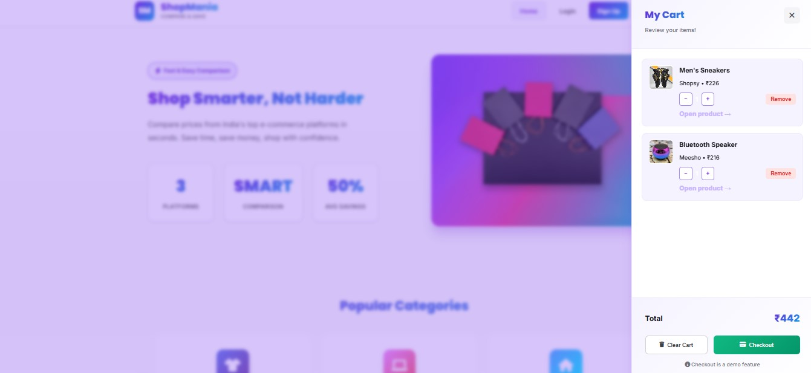
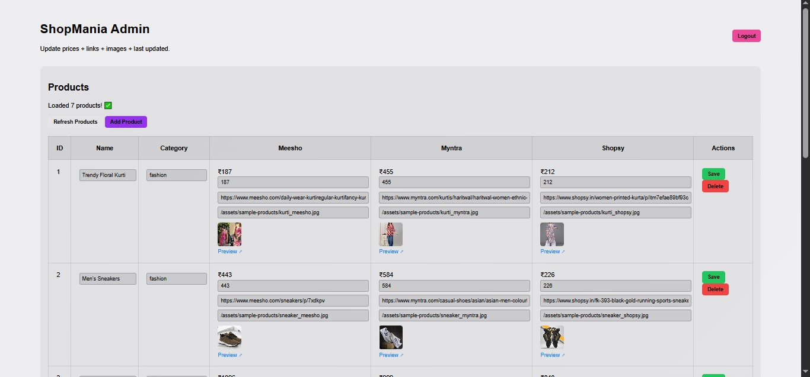

# 🛍️ ShopMania – Price Comparison Web Application

ShopMania is a full-stack web application that enables users to compare product prices across platforms like Meesho, Myntra, and Shopsy. It is designed to help users make smarter purchasing decisions while demonstrating strong backend and full-stack development skills.


## 🚀 Features

* 🔍 Compare product prices across multiple platforms
* 🛒 Add to cart functionality (localStorage-based)
* 🧑‍💼 Admin panel for managing products (Add / Update / Delete)
* 🔐 Authentication system with backend API integration
* 📧 Automated welcome email system using Gmail SMTP
* 🎨 Interactive and responsive UI (carousel, product cards)


## 🏗️ Tech Stack

### Backend:

* Java 17
* Spring Boot
* Spring Data JPA
* Hibernate
* MySQL
* Maven

### Frontend:

* HTML
* CSS
* JavaScript

## 📸 Screenshots

### 🏠 Homepage


### 🎯 UI Highlight



### 🛍️ Products



### 🛒 Cart Page



### 🧑‍💼 Admin Panel (CRUD Operations)



## ⚠️ Note

This project is currently **not deployed**.
To run the application locally, follow the steps below.


## ⚙️ Installation & Setup

### 1. Clone the Repository

```bash
git clone https://github.com/your-username/shopmania.git
cd shopmania
```

### 2. Open in IDE

Use **VS Code / IntelliJ IDEA**


### 3. Configure Database (MySQL)

Update `application.properties`:

```properties
spring.datasource.url=jdbc:mysql://localhost:3306/shopmania
spring.datasource.username=YOUR_USERNAME
spring.datasource.password=YOUR_PASSWORD

spring.jpa.hibernate.ddl-auto=update
spring.jpa.show-sql=true
```

👉 Make sure MySQL is running and database `shopmania` is created.


### 4. Run the Backend

```bash
mvn spring-boot:run
```


### 5. Access the Application

Open browser:

```
http://localhost:8080
```


## 📂 Project Structure

```
ShopMania/
├── src/main/java/com/shopmania
│   ├── controller
│   ├── service
│   ├── repository
│   ├── entity
│   └── config
├── src/main/resources
│   ├── static (HTML, CSS, JS)
│   └── application.properties
```


## 💡 Future Improvements

* 🌐 Deploy on cloud (AWS / Render / Railway)
* 🔄 Integrate real-time APIs for live price comparison
* 💳 Add payment gateway
* ⚛️ Upgrade frontend to React


## 👩‍💻 Author

**Sulekha Thakur**
Backend Developer | Java | Spring Boot

## 🎯 Project Objective

This project highlights strong backend development, REST API design, database integration, and full-stack implementation using Java Spring Boot.


